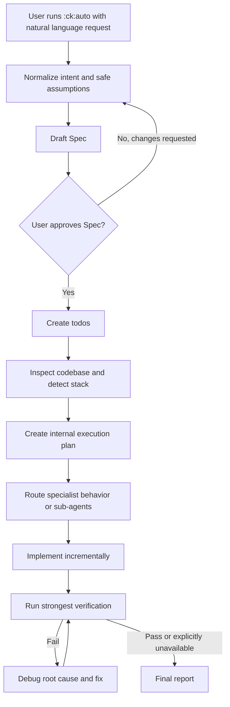

# Auto Workflow Reference

This reference defines the `:ck:auto` ForgeCode-native non-technical autopilot journey. Compatibility targets may expose the same behavior as `/ck:auto`.

## Flow

## One-Approval Rule

Only the Spec needs user approval. After approval, all normal engineering decisions are delegated to the assistant. Do not ask for approval of the internal plan, file list, implementation approach, or tests unless a hard blocker appears.

## Intent Normalization

The user may be non-technical, vague, or outcome-focused. Convert the request into a Spec by:

- inferring safe defaults from the existing project;
- listing assumptions instead of repeatedly asking questions;
- avoiding implementation before approval;
- asking one focused clarifying question only for impossible, destructive, credential-dependent, or high-risk decisions.

## Existing Workflow Reuse

`:ck:auto` should reuse existing ForgeKit machinery internally instead of replacing it:

- Apply `ck:cook --auto` semantics for implementation.
- Use planner/researcher behavior for unclear architecture or large tasks.
- Use fullstack-developer/forge behavior for code changes.
- Use tester/debugger behavior for verification and failure repair.
- Use code-reviewer/docs-manager behavior when quality or docs are relevant.
- If ForgeCode can launch sub-agents, split independent planning/implementation/testing/review streams. If it cannot, apply the specialist behavior directly and do not claim agents were launched.

## Verification Protocol

Before final reporting:

1. Prefer project scripts: test, build, lint, typecheck, e2e.
2. If scripts are missing, run framework-specific static or smoke checks.
3. If no meaningful verification exists, state that clearly and explain what was inspected instead.
4. If verification fails, fix root cause and rerun until passing or blocked.

## Hard Blockers That May Ask the User Again

- Credentials or secrets required.
- Destructive action risk.
- Production payment/legal/privacy/security decision.
- External access impossible without user input.
- Product decision cannot be safely inferred.

## Final Report

Keep the final report short and understandable for a non-technical user:

- result status;
- what changed;
- what was verified;
- files changed;
- anything the user must do next.
